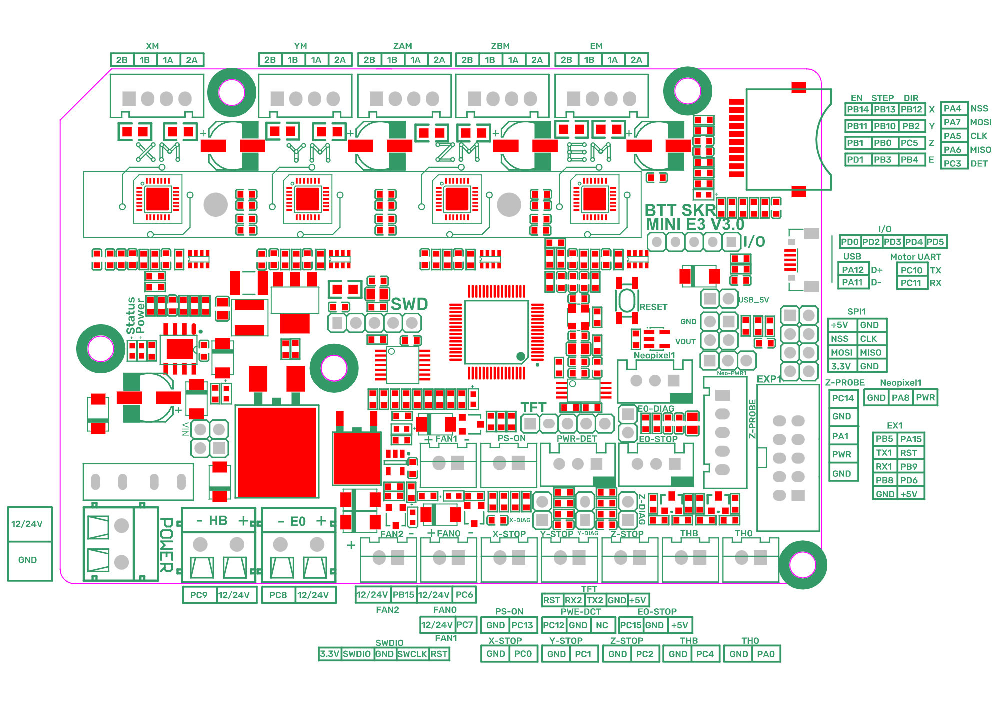

# Custom Ender 3 Pro Firmware using Marlin
Please note this is a custom Marlin firewamre (Bugfix 2.1.x) that I made for my printer with parts listed below. 

I have also included a precompiled version of the firmware based on Marlin Bugfix 2.1.X. Your milage may vary, install at your own risk.

I had to make edit to the pins_BTT_SKR_MINI_E3_V3_0.h file in order to get the fans and BLTouch probe working as intended. I will outline all my changes below

## Printer

- Ender 3 Pro
- Big Tree Tech SKR Mini e3 v3.0 Control Board
- Creality Sprite Extruder Pro
- BLTouch

## Congifuration Edits

### Configuration.h

- #define BAUDRATE 250000
- #define CUSTOM_MACHINE_NAME "Ender-3 Pro"
- #define DEFAULT_AXIS_STEPS_PER_UNIT   { 80, 80, 400, 424.9 }
- #define Z_MIN_PROBE_USES_Z_MIN_ENDSTOP_PIN (Enable this)
- #define USE_PROBE_FOR_Z_HOMING (Enable this)
- #define Z_MIN_PROBE_PIN PC14 (Enable this and set for pin of SKR Mini e3)
- #define BLTOUCH (Enable this)
- #define NOZZLE_TO_PROBE_OFFSET { -36.5, -40, 0 }
- #define XY_PROBE_FEEDRATE (10000)
- //#define MIN_SOFTWARE_ENDSTOP_Z
- //#define MAX_SOFTWARE_ENDSTOP_Z
- #define AUTO_BED_LEVELING_BILINEAR (Enable this, disable others)
- #define HOMING_FEEDRATE_MM_M { (40*60), (40*60), (8*60) }
- #define GRID_MAX_POINTS_X 3
- #define Z_SAFE_HOMING

### Configuration_adv.h
- #define CONTROLLER_FAN_PIN FAN2_PIN
- #define CONTROLLER_FAN2_PIN FAN1_PIN
- #define PROBE_OFFSET_WIZARD
- #define FILAMENT_CHANGE_UNLOAD_LENGTH      50
- #define FILAMENT_CHANGE_FAST_LOAD_LENGTH   50
- #define ADVANCED_PAUSE_PURGE_LENGTH         10

### pins_BTT_SKR_MINI_E3_V3_0.h

I had to change the Z_STOP_PIN since I don't have a physical Z-Stop anymore. I would run into a weird error where when the printer wanted to home itself X and Y worked, and the Probe on the BLTouch would Extend and Retract a few times before the printer just said `STOPPED`

- #define Z_STOP_PIN                          PC14   // Z-STOP

## Fan Layout

- Fan under the printer on the SKR Mini - FAN1 (PC7)
- Fan on the Sprite Pro - FAN2 (PB15)
- Parts Cooling Fan - FAN0 (PC6)

